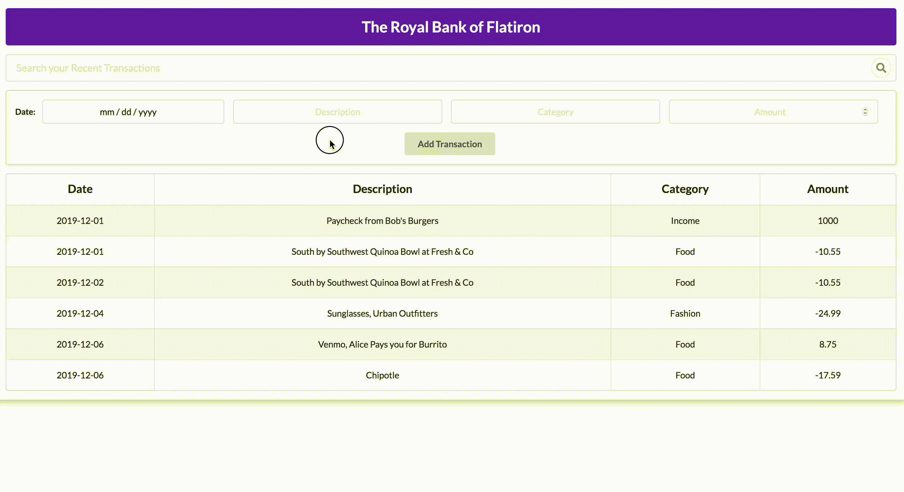

# Bank of Flatiron

Welcome to the Bank of Flatiron, where you can trust us with all your financial data! Use the below gif as an example of how the app should function.

## Instructions

For this project, you’ll be building out a React application that displays a list of your recent bank transactions, among other features.

Part of what this code challenge is testing is your ability to follow given instructions. While you will definitely have a significant amount of freedom in how you implement the features, be sure to carefully read the directions for setting up the application.

## Setup

After cloning down the project:

1. Run `npm install` in your terminal
2. Run `npm start`: This will open both your React page on port `6002` and your backend on port `6001`.
3. The app uses [Semantic UI](https://semantic-ui.com/) for styling. If you see any unfamiliar classNames on some components, don't sweat! That's coming from Semantic UI and you shouldn't need to touch it.
4. If you are unfamiliar with HTML tables, take a look at the [docs with an example here](https://www.w3schools.com/html/html_tables.asp)

## Endpoints

The base URL for your backend is: `http://localhost:6001`

These are the endpoints you might need:

- GET: `/transactions`
- POST: `/transactions`
- DELETE: `/transactions/:id`

## Core Deliverables

As a user, I should be able to:

<!-- - See a table of the transactions. -->
- Fill out and submit the form to add a new transaction. This should add the new transaction to the table **as well as post the new transaction to the backend API for persistence**.
- Filter transactions by typing into the search bar. Only transactions with a description matching the search term should be shown in the transactions table.

## Advanced Deliverables

These deliverables are not required to pass the code challenge, but if you have the extra time, or even after the code challenge, they are a great way to stretch your skills.

> Note: If you are going to attempt these advanced deliverables, please be sure to have a working commit with all the Core Deliverables first!

As a user, I should be able to:

- Sort transactions alphabetically by category or description.
- Delete a transaction which will remove it from the table and delete it from the backend.

## Rubric

You can find the rubric for this assessment [here](https://github.com/learn-co-curriculum/se-rubrics/blob/master/module-4.md).
